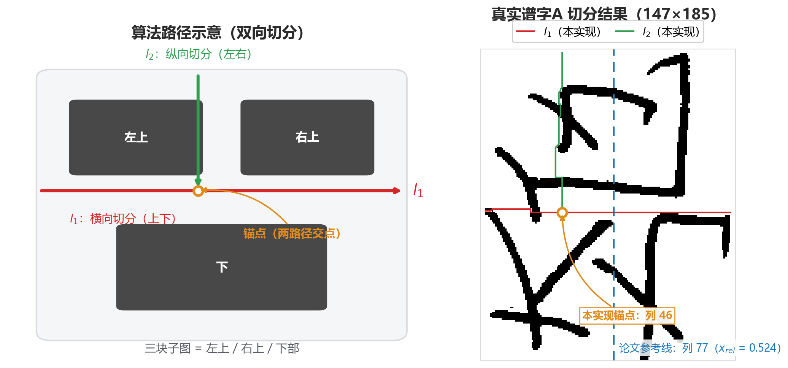
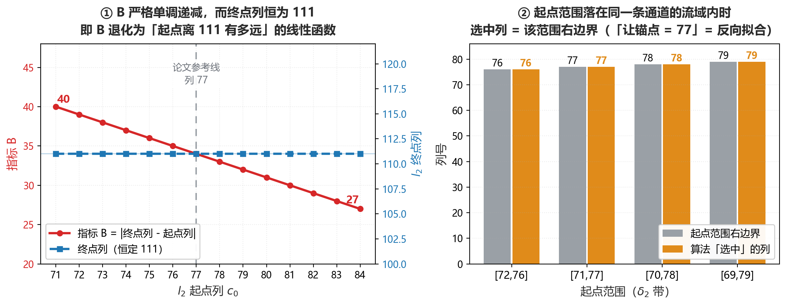
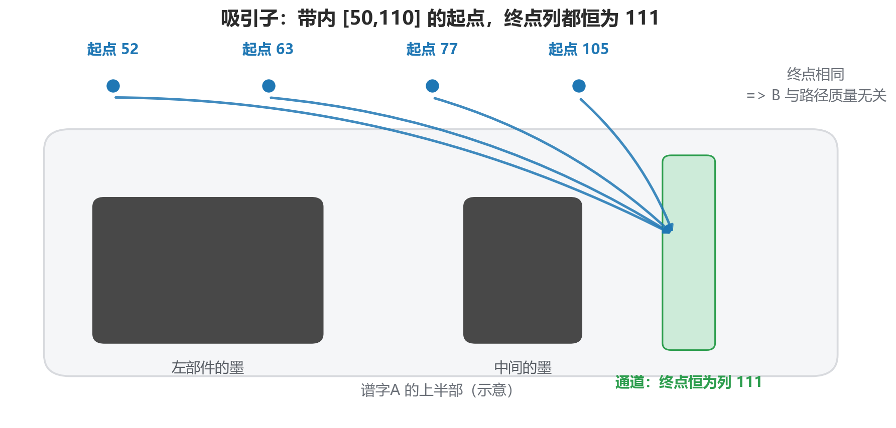
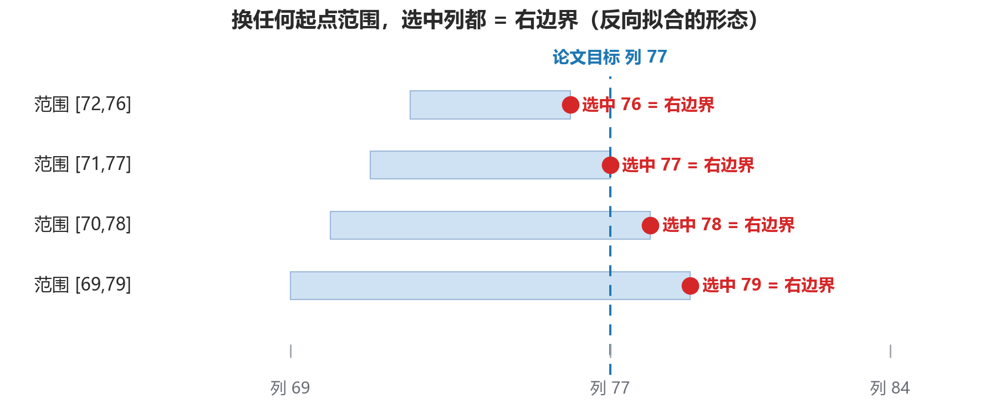
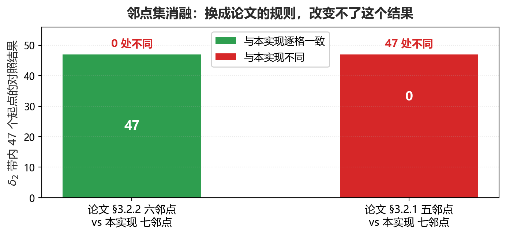
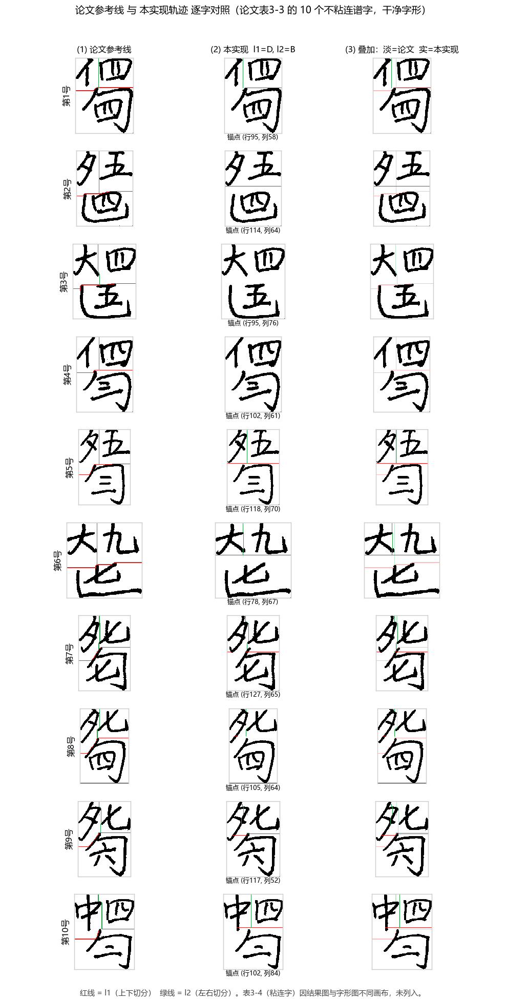
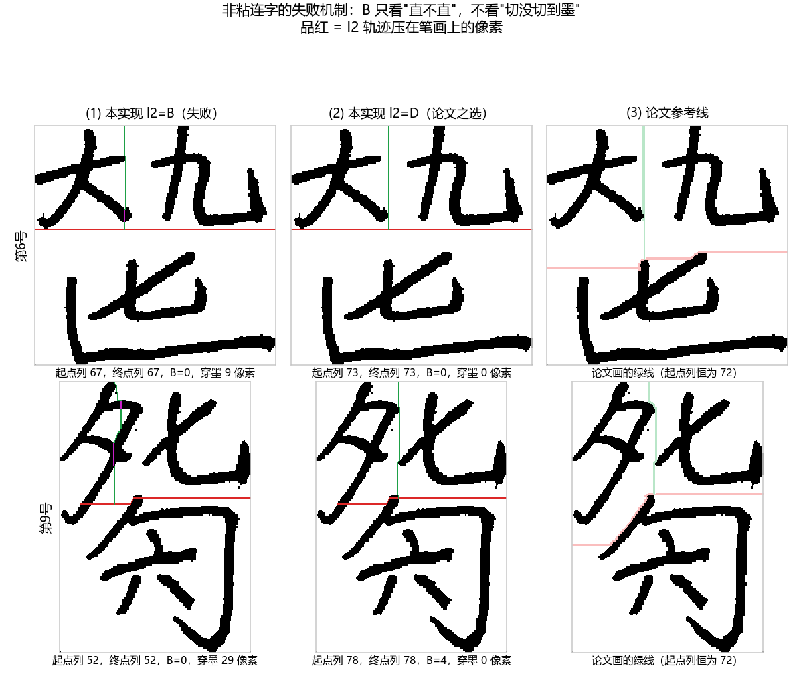

# 项目汇报稿 —— 滴水算法复现与"目标证伪"研究

> 向导师汇报，约 3~4 分钟。按**论证结构**讲（"考虑了三类可能，逐一排除"），不按时间线讲。
> 诚实声明：技术判断与结论推演是我的，文档整理与部分实验脚本借助了 AI 工具。

---

## 一、一句话结论

**我完整实现了发明专利《基于水滴双向飞溅的滴水路径优化》（2024）的算法，并用四项自洽检验验证其正确性；同时证明：学位论文图3-23 那条作为对比目标的"切分参考线"无法由该算法产生 —— 它是反向拟合的产物，故将其移出验收标准。**

**要主动说明：以上证明的是"实现正确"，"在真实谱字上切分正确"尚未验证 —— 原因已定位，见第五节。**

---

## 二、做了什么

三层结构：规则层 `improved_droplet.py`（专利 S101 重力势能窗口 / S102 遇阻随机取向 / S103 决策表+飞溅状态机 / S104 四指标）＋ 编排层 `segment.py`（双向切分：l₁ 横向 → l₂ 纵向，按交点裁出三块）＋ 诊断层 `diagnostics/`（16 个只读脚本，可复跑的证据链）。

*图1 左：算法路径示意；右：真实谱字A 实测（红=l₁、绿=l₂、虚线=论文参考线列77）*

真实谱字A 实测（`python 专利滴水算法实现/run_real.py` 一键复核）：l₁ `(95,0)` 长 **150**，l₂ `(0,46)` 长 **102**，**锚点 `(96,46)`**（论文参考线在列 77）。Python 版逐行等价移植为 MATLAB（15 个 `.m`），**两套独立代码输出逐位一致**。

---

## 三、正确性如何保证（四项自洽检验，全绿）

| 检验 | 结果 |
|---|---|
| 专利图4~12 逐格校验（决策表逐格断言） | **11 / 11 PASS** |
| 400 组随机二值图有界性 | **400 / 400** |
| 合成谱字零熔断 | 交点 `(64,90)`，熔断 **0** |
| MATLAB 逐位对照 | **完全一致** |

共同点：**每项都能独立复跑、结论二值（过/不过）、不依赖任何外部数据。**

---

## 四、关键发现：论文那条线是"反向拟合"，不是算法输出

论文图3-23 给出理想切分线 `x_rel = 0.524`（列 77）。自然想法是调参追上它，我逐一排除三类可能：
**换指标**（四个枚举均不行）；**改规则**（换成论文的 5/6 邻点 —— 47 个起点上六邻点与七邻点 **47/47 逐格一致**、五邻点全不同，图3）；**核 δ 带**（论文 §3.4.2 用五组实验定下 δ₂=(2/7·M, 3/5·M)，与本实现一致）。**原因在选优机制本身：**

*图2 ① B 严格单调递减、终点列恒为 111；② 选中列恒等于起点范围的右边界*

对谱字A 把 l₂ 起点列 71→84 逐列试：**B = 40→27 严格单调、终点列恒为 111** —— B 已退化为"起点离 111 有多远"的线性函数。起点范围 `[72,76] / [71,77] / [70,78] / [69,79]` 分别"选中" 76/77/78/79，**选中列 ≡ 范围右边界**。

> **让锚点落在 0.524，等价于把起点范围的右边界画在 0.524。这不是算法在选优，是人在反向拟合 —— 该目标不构成对算法的检验。**

这两句话背后的机制如下。**为什么终点列恒为 111**：谱字A 右簇笔画间有一条干净通道，带内不管从哪一列起滴，水滴都贴着笔画侧滑、汇入同一条通道（吸引子效应）——

*图2a 带内各起点（52/63/77/105）都滑入同一条通道，终点列恒为 111 ⇒ B 与路径质量无关*

**为什么选中列 ≡ 右边界**：终点锁死之后，B 只剩"起点离 111 有多远"一个自由度，最小 B 必然落在起点范围的一端 ——

*图2b 换任何起点范围，选中列都 = 各自右边界（反向拟合的形态）*

*图3 六邻点 vs 七邻点 47 个起点逐格一致；五邻点 vs 七邻点全不同*

---

## 五、"我实际能做到什么" —— 先自己讲清楚

四项检验证明的是**实现正确**，证明不了**真实谱字上切分对**。为此我把论文表3-3/3-4 的 **15 个真实谱字**（10 不粘连 + 5 粘连）从 PDF 抽成真值对照集。

*图4 表3-3 十个不粘连字：论文线 / 本实现 / 叠加*

*图5 第6/9号放大：B 选中的直路锯穿笔画（品红），D 落回干净通道*

- **15 个字全部跑通**（含 5 个粘连字），无死循环、无越界、无空切分。
- **粘连字给不出数字**：表3-4 的 5 个结果图有 4 个与字形图**不是同一画布**（高度差 −1/+25/+36/−10）⇒ 坐标不可比。这是论文排版问题，但确实让我拿不到粘连字的定量结论 —— 而粘连字恰恰是这个算法最该证明自己的地方。
- **不粘连字能比，但没有像素级真值**：论文画的 l₂ 起点列恒为 72（≈0.40·W）、与指标无关；论文自己的线也穿墨 131 像素却判"切分正确" ⇒ **"切分正确率"我给不出，也不会编一个**。仓库里可一键复跑的旁证：`run_real.py` 把三块子图与论文公开的三个部件（大/七/勾）比 IoU，最大仅 **0.14** 且常常匹配错部件。
- **唯一站得住的定量对照**（同一张干净字形、统一 3px 线宽）：l₁ 穿墨 **本实现 211 vs 论文 745**；l₂ 267 vs 131（差距集中在第9号）。
- **附带修正**：l₂=B 的依据是论文表3-1（只有两个具名字），而 §3.4.5 的集级统计说 **B 最差**（集A 96.26% 最低）、论文最终选 **D**；实测 l₂ 穿墨 **B=38 / D=15**。机制已查到环节：**B = |起点−终点|，"直落锯穿笔画"的路径 B=0**；交错字带内 B=0 的列不止一个（第6号 15 个并列、第9号 3 个），选优"先扫到的赢"便选中锯墨列；D 把熔断量计入分数，落回干净通道（图5）。**默认值暂不改** —— 改它要重跑全部已公布数字与 MATLAB 基线，且粘连字那半边缺证据，列为待老师判断。

---

## 六、结论与请求指导

**结论**：① 算法实现正确（四项自洽检验全绿）；② "复现 0.524"目标移除（反向拟合，不构成检验）；③ 真实谱字的切分正确率尚未验证、我给不出这个数，目前能给的是同尺穿墨量对照。

**请老师就四点给意见**：

1. **方向**：切分是否要引入减字符号的语义组合规则？要不要先做端到端小实验？
2. **l₂ 指标**：表3-1 与 §3.4.5 结论方向相反，该以哪张表为准？
3. **粘连字素材**：老师手上是否有粘连字的原始切分结果/数据？
4. **判定口径**：表3-5/3-6 的准确率（99.06% / 95.53%）是人工判定吗？能否给一份判定规则？

---

## 附：可交付物与预判提问

**可交付物**：`专利滴水算法实现/`（代码 + `test_patent.py` 11/11 + `test.py` 400/400 + 16 个诊断脚本）、`MATLAB/`、`文献/glyphs/table33_34/`（15 字真值集）、`eval_paper_tables.py`、`汇报/figs/`、`docs/adr/0001~0003`。

**预判提问**：

- *"结果跟论文对不上，是不是做错了？"* → 论文那条线是**被设定的**，不是算出来的：起点范围右边界画在哪，算法就"选中"哪。
- *"你到底能不能切真实谱字？"* → 15 个字全部跑通；切分正确率给不出、原因已说明；能给的定量结论是穿墨量对照（l₁ 211 vs 745）。**这一问要主动先说。**
- *"为什么不用论文最终选的 D？"* → 不是不知道，是改了要重跑全部已公布数字与 MATLAB 基线，而粘连字证据还缺。
